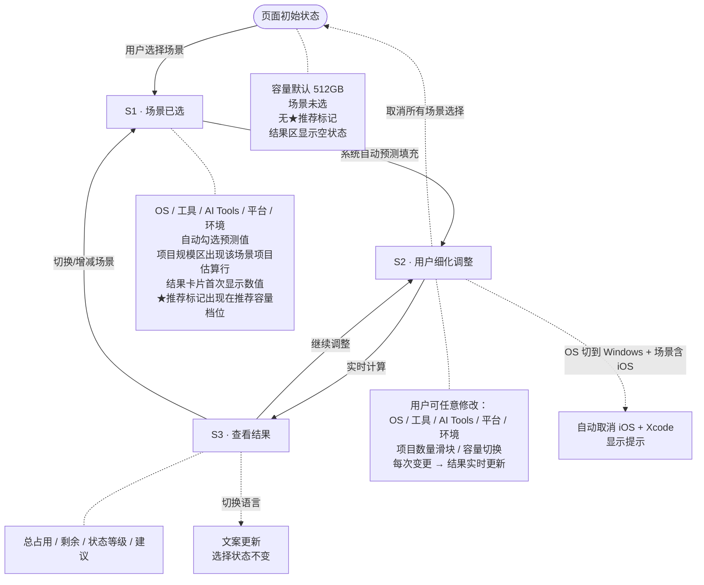
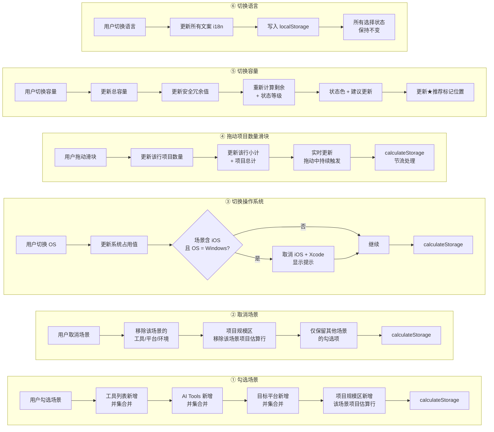

# Design Spec — 512GB or 1TB

## 设计风格

- **简洁** — 无多余装饰，信息层级清晰
- **工具感** — 像专业工具一样直接、可信
- **轻科技** — 适度现代感，但不炫技
- **决策导向** — 帮助用户快速做出判断，而非沉浸在浏览中

目标人群：开发者、设计师、创作者。

## 色彩规范

暗色模式。色板来源：Stitch Concept 4 "Capacity Engineered" 设计系统。

### 背景与表面层级

| 名称 | 色值 | 用途 |
|------|------|------|
| 主背景 | `#0b1326` | 页面主背景 |
| 次背景 | `#131b2e` | 区块分隔、页脚 |
| 卡片背景 | `#171f33` | 卡片、面板背景 |
| 卡片背景高 | `#222a3d` | 嵌套卡片、悬停态 |
| 卡片背景最高 | `#2d3449` | 输入框、标签未选中态 |

### 文字层级

| 名称 | 色值 | 用途 |
|------|------|------|
| 主文字 | `#dae2fd` | 标题、正文 |
| 次文字 | `#c3c6d7` | 说明文字、标签 |
| 辅助文字 | `#8d90a0` | 辅助文字、占位符 |

### 强调色与交互

| 名称 | 色值 | 用途 |
|------|------|------|
| 强调色 | `#b4c5ff` | 选中态文字、链接、图标高亮 |
| 强调色实心 | `#2563eb` | 选中态边框、按钮背景、活动状态 |
| 边框 | `#334155` | 卡片边框、分隔线 |
| 边框悬停 | `#475569` | 悬停态边框 |

### 状态色

| 状态 | 颜色 | 用途 |
|------|------|------|
| 充裕 | `#10B981` | 绿色，剩余 > 40% |
| 舒适 | `#3B82F6` | 蓝色，剩余 20%-40% |
| 可用但需管理 | `#F59E0B` | 琥珀色，剩余 10%-20% |
| 紧张 | `#EF4444` | 红色，剩余 < 10% |

### 占用分段色（进度条）

7 段占用使用蓝-灰色系递进，在暗色背景上保持区分度：

| 类别 | 颜色 |
|------|------|
| 系统占用 | `#2563eb` |
| 工具链 | `#3b5ba5` |
| AI Tools | `#475569` |
| 目标平台 | `#5b6e8c` |
| 运行环境 | `#334155` |
| 项目文件 | `#b4c5ff` |
| 安全冗余 | `#64748b` |
| 剩余空间 | 透明，底色透出，不额外着色。状态通过结果卡片整体状态色和文字徽章表达 |

## 字体规范

- **UI 字体**：`"Inter", -apple-system, BlinkMacSystemFont, "Segoe UI", Roboto, "PingFang SC", "Microsoft YaHei", sans-serif`
- **数字/标签字体**：`"JetBrains Mono", "SF Mono", "Fira Code", "Consolas", monospace`
  - 用于：容量数字、GB 数值、统计小计、标签文字、日志式文案
- 中文回退：Inter 不含中文字形，回退到 PingFang SC / Microsoft YaHei

### 数字与单位排版规则

- 容量单位（GB/TB/MB）与数字之间**不加空格**：`512GB`、`1TB`、`50GB`
- 百分号与数字之间**不加空格**：`53%`
- 中文与数字之间**加一个空格**：`剩余 53%`、`25 个项目`
- 英文标签方括号内数字与单位同样不加空格：`[2GB]`、`[15GB]`
- 所有数字与单位统一使用 JetBrains Mono 等宽字体

### 字号层级

| 层级 | 桌面端 | 移动端 | 字重 | 用途 |
|------|--------|--------|------|------|
| H1 | 48px | 32px | 700 | 首屏主标题 |
| H2 | 28px | 22px | 600 | 区块标题 |
| H3 | 20px | 18px | 600 | 卡片标题 |
| Body | 16px | 15px | 400 | 正文 |
| Small | 14px | 13px | 400 | 说明、标签 |
| Caption | 12px | 12px | 400 | 辅助文字、版权 |

## 布局规范

### 全端统一单列布局

- 最大宽度：800px，居中
- 所有状态页面均为单列纵向排列
- 间距：区块间 32px，卡片内 24px
- S1 配置态：sticky 迷你结果条固定在 Header 下方
- S3 结果态：结果卡片居中展示，无 sticky

### 移动端（< 768px）

- 单列布局，最大宽度 100%
- 全宽卡片，内边距 16px
- 选择器改为垂直堆叠

## 组件规范

### 顶部导航

- 高度：64px
- 背景：`#0b1326`，底部 1px 边框 `#334155`
- 左侧：产品名（字号 18px，字重 700，色 `#b4c5ff`）
- 右侧：语言切换按钮（中文 / English）
- GitHub 图标链接（可选）

### 首屏（Hero）

- 背景：`#0b1326`
- S0 空状态：标题居中 + 说明文案 + 场景选择引导
- S1 配置态 / S3 结果态：紧凑 Hero（标题居中，无副标题，字号 1.25rem，padding 24px 16px）
- CTA 按钮（仅 S0）：`#2563eb` 背景，`#dae2fd` 文字，圆角 8px，padding 12px 32px

### 场景选择卡片

- 6 张卡片，2×3 Bento 网格布局，支持多选
- 每张卡片包含：Lucide 图标 + 场景名称 + 一句话定义
- 背景：`#171f33`，边框 `#334155`
- 圆角：12px
- 内边距：24px
- 选中态：边框 `#2563eb` 2px，背景 `rgba(37, 99, 235, 0.1)`
- 图标尺寸：24px，未选中 `#c3c6d7`，选中 `#b4c5ff`

### 迷你结果条（MiniResultBar）

- 位置：S1 配置态 Header 下方，sticky 定位
- 内容：进度条 + 百分比，状态色随剩余空间变化（紧张红 / 可用琥珀 / 舒适蓝 / 充裕绿）
- S0 空状态 / S3 结果态：不显示
- 进度条与底部结果卡片互补：迷你条只显示进度+比例，详细数字在 S3 结果卡片

### 细化配置区

- 5 个子模块全部展开，不可折叠
- 操作系统：三选一按钮组（macOS / Windows / Linux），场景推荐默认值，选中态为品牌蓝实心填充
- 工具：多选标签组，按类别分组（编辑器 / 版本控制 / 运行时 / 平台 SDK / 设计 / 游戏引擎），每组内横向排列，其中 Unity 与 Unreal 为互斥标签
- AI Tools：多选标签组（Cursor / ChatGPT / GitHub Copilot / Claude Code）
- 目标平台：多选标签组
- 运行环境：多选标签组
- 标签未选中态：背景 `#2d3449`，边框 `#334155`，文字 `#c3c6d7`
- 标签选中态：边框 `#2563eb` 2px，背景 `rgba(37, 99, 235, 0.1)`，文字 `#b4c5ff`
- 分组标题：JetBrains Mono，12px，大写，色 `#8d90a0`

### 项目规模区

- 每个选中场景独立一行（项目估算行）
- 每个项目估算行包含：场景名称 + 单项目大小（固定文案，如"5GB/个"）+ 数量滑块（1-50）+ 小计
- 底部显示"项目文件总计"
- 多选场景时，默认每场景 5 个；单选时默认 10 个

### 容量选择

- 按钮组：256GB / 512GB / 1TB / 2TB
- 仅在 S1 配置态展示
- 选中态：品牌蓝 `#2563eb` 实心填充 + 白字（强视觉权重）
- 推荐态：琥珀色 `#F59E0B` 边框 + 透明背景 + ★标记（弱视觉权重，不与选中态竞争）
- 选中态与推荐态视觉差异明确：实心填充 vs 边框轮廓
- 内联提示：容量紧张时在容量按钮组下方显示"推荐选择更大容量"（琥珀色文字）
- 用户手动选择其他容量：选中档位实心高亮，★推荐标记保留在系统推荐档位

### 结果卡片

- 仅在 S3 结果态展示，S1 配置态不展示结果卡片
- 顶部标注当前场景（小字，如"场景：Web开发"）
- 背景：`#171f33`
- 边框：`#334155` 1px
- 圆角：12px
- 内边距：32px
- 总容量大数字展示（JetBrains Mono，1.5rem）
- 分段进度条（8 段，各占用类别用不同颜色，剩余段为透明底色透出）
- 分级占用明细（系统 / 工具链 / AI Tools / 目标平台 / 运行环境 / 项目文件 / 安全冗余）
  - 明细数字用 JetBrains Mono
- 状态徽章（圆角标签，带对应状态色）
- 购买建议文字区
- 不展示档位对比（仅用★推荐标记指示推荐档位，★在 S1 配置态容量选择器中展示）

### 分段进度条

- 高度：24px（桌面），20px（移动）
- 圆角：12px
- 背景：`#2d3449`（进度条底色，剩余段即为此底色透出）
- 8 段按比例分配宽度：系统 / 工具链 / AI Tools / 目标平台 / 运行环境 / 项目文件 / 安全冗余 / 剩余
- 已用 7 段各有独立颜色，剩余段为底色透出不额外着色
- 段间无间隙或 1px `#0b1326` 间隙
- 悬浮提示显示具体 GB 数（可选）

### 估算说明

- 独立 section，放在结果区域之后、页脚之前
- 背景：`#131b2e`，边框 `#334155` 1px
- 圆角：12px
- 内边距：32px
- 内容包含：
  - 声明文案："购买决策级别的估算，不是精确磁盘检测工具"
  - 建议保留 15%-20% 空闲空间
  - 隐私声明："纯本地计算，不收集数据"
  - 数据更新日期（JetBrains Mono，色 `#8d90a0`）
  - 估算方法简述：区分"固定数据"（如系统安装大小）和"经验假设"（如工具缓存与依赖）
- 文字层级：声明文案用主文字 `#dae2fd`，说明文字用次文字 `#c3c6d7`，日期和方法用辅助文字 `#8d90a0`

### 页脚

- 背景：`#131b2e`
- 上边框：1px `#334155`
- 内边距：48px
- 文字居中，色 `#8d90a0`
- 包含：版权、GitHub 链接、免责声明

## 交互规范

### 场景选择交互

- 多选：点击卡片选中/取消，即时生效
- 选中场景后，细化配置区自动填充预测值
- 选中场景后，项目规模区自动出现该场景的项目估算行
- 取消选中场景后，对应的项目估算行从项目规模区移除

### 细化配置交互

- 工具/平台/环境：多选，点击勾选/取消
- AI Tools：多选，点击勾选/取消
- OS 切换：按钮组（macOS / Windows / Linux），切换后联动更新
- 所有选择变更后，结果卡片在 200ms 内更新

### 项目规模交互

- 滑块拖动：实时更新小计和总计
- 数字变化建议使用短暂过渡动画

### 语言切换

- 点击切换后，整页文案即时更新
- 选择记录到 localStorage
- 切换时保持当前所有选择状态不变

## 用户操作流程图

### 第一层：页面状态流（宏观）

展示用户从进入到离开的完整路径，每个节点是一个页面状态。

**状态说明：**

| 状态 | 触发条件 | 页面表现 |
|------|---------|---------|
| S0 初始 | 页面加载 | 容量默认 512GB，场景未选，无★推荐标记，结果卡片占位状态（大数字"—"，进度条空白，引导文案"请先选择使用场景开始估算"），快速推荐条不显示 |
| S1 场景已选 | 用户勾选至少一个场景 | 系统自动填入预测值，★推荐标记出现在推荐档位，结果卡片首次显示数据，快速推荐条显示方向性预判 |
| S2 细化调整 | 用户在 S1 基础上修改任意配置 | 每次变更触发实时计算（<200ms），结果卡片实时更新 |
| S3 查看结果 | 计算完成 | 显示总占用、剩余、状态等级、建议 |

**边界情况：**

| 边界场景 | 系统响应 |
|---------|---------|
| 取消所有场景选择 | 回到 S0 占位状态（"—"+空白进度条+引导文案），快速推荐条隐藏，★推荐标记消失 |
| OS 切到 Windows 且场景含 iOS | 自动取消 iOS 平台 + Xcode，Toast 提示"已切换到 Windows，iOS 平台和 Xcode 已移除（需要 macOS 构建 iOS 应用）"，3 秒自动消失 |
| 切换语言 | 全部文案更新，所有选择状态不变，不触发计算 |
| 结果状态变化 | 充裕→绿色 / 舒适→蓝色 / 可用但需管理→琥珀色（建议升级）/ 紧张→红色（不建议该容量） |

### 第二层：操作响应流（微观）

展示每个用户操作触发的系统响应链。所有操作最终汇聚到 `calculateStorage()` 重新计算结果。

**关键联动规则：**

| 操作 | 联动项 | 规则 |
|------|--------|------|
| 勾选场景 | 工具 / AI Tools / 平台 / 环境 | 取所有选中场景的**并集**，不覆盖用户已手动取消的项 |
| 勾选场景 | 项目规模区 | 新增该场景的项目估算行，默认数量：单选 10 / 多选各 5 |
| 勾选场景 | OS 预测 | 多数场景一致取一致值；不一致取 macOS |
| 取消场景 | 工具 / AI Tools / 平台 / 环境 | 仅移除该场景独有的项；其他场景也包含的项保留 |
| 取消场景 | 项目规模区 | 移除该场景的项目估算行 |
| 取消所有场景 | 全局 | 回到 S0 空状态 |
| OS 切换 | 系统占用 | macOS 75GB / Windows 80GB / Linux 45GB |
| OS 切换 + 场景含 iOS | 平台 + 工具 | 自动取消 iOS 平台 + Xcode，显示提示 |
| 拖动滑块 | 该行小计 + 项目总计 + 结果 | 实时更新，`calculateStorage` 需节流（如 100ms） |
| 切换容量 | 安全冗余 + 剩余 + 状态 | 按容量阶梯更新冗余值，重新计算状态等级 |
| 任意配置变更 | 推荐容量标记 | 重新计算推荐容量，★标记移动到对应档位（用户选中的容量不变） |
| 切换语言 | 文案 | 全部 i18n 更新，不触发计算，选择状态不变 |

**并集合并的细节规则：**

当用户新增勾选一个场景时，该场景的默认工具与当前已勾选工具取并集。但如果用户之前手动**取消勾选**了某个工具，新增场景不应自动重新勾选它——即"用户的手动取消优先于场景预设"。

## 视觉禁区

1. **不使用**大面积渐变背景
2. **不使用**强烈阴影或弥散阴影（暗色模式下用边框和背景层级区分层次，不用阴影）
3. **不使用**玻璃拟态（glassmorphism / `backdrop-filter`）——移动端性能风险，与克制风格冲突
4. **不使用** 3D 可视化效果（Three.js / CSS 3D Transforms）
5. **不使用**圆角过大的按钮（不超过 12px）
6. **不使用**超过 3 种主色（暗色蓝灰底 + 蓝强调 + 状态色）
7. **不使用**装饰性插图或图标泛滥
8. **不使用**固定背景图或视差滚动
9. **不引入**非必要动画（如加载动画、粒子效果、实时日志流）
10. **不使用**纯黑 `#000000` 作为背景——使用 `#0b1326` 深蓝黑保持温度感

## 响应式断点

| 断点 | 宽度 | 布局变化 |
|------|------|---------|
| sm | < 640px | 单列，紧凑间距，全宽卡片 |
| md | 640px - 767px | 单列，标准间距 |
| lg+ | >= 768px | 单列，最大宽度 800px 居中 |

## 素材需求

### Logo

- 第一版可用文字 Logo："512GB or 1TB"
- 后续可设计图形 Logo，风格需简洁几何

### 图标

- 使用 Lucide React 图标库（轻量、统一风格）
- 主要图标：硬盘、工具、代码、设计、手机、电脑、容器、芯片等

### 图片

- 第一版不需要图片素材
- 后续专题页面可能需要截图或插图